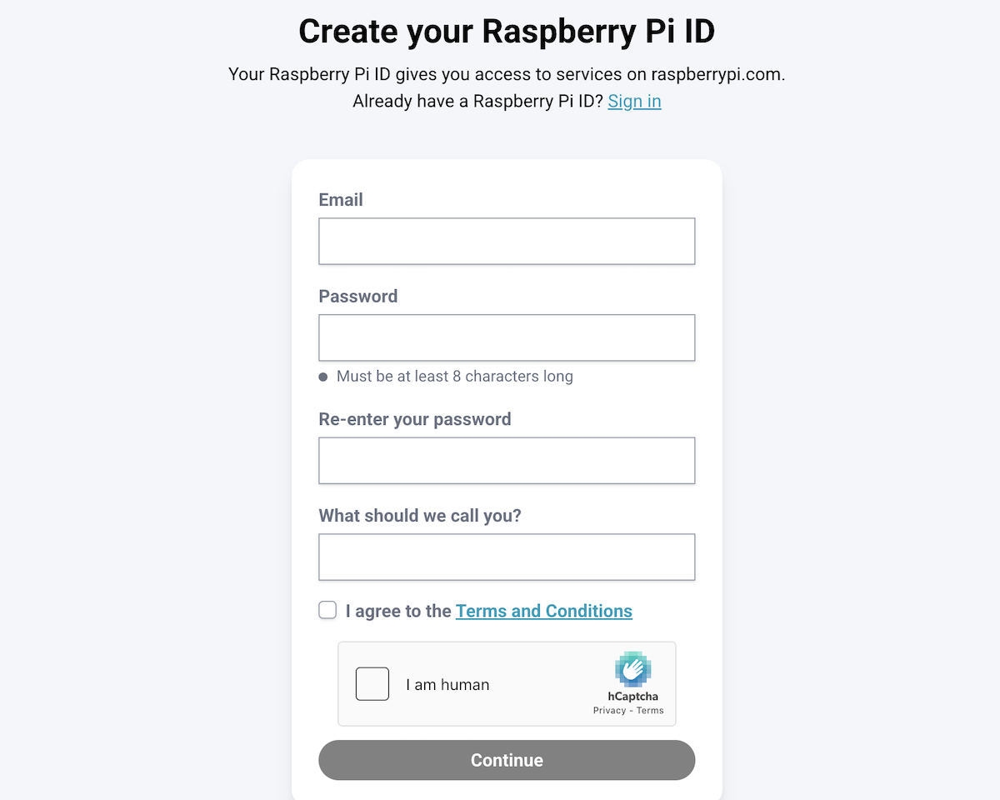
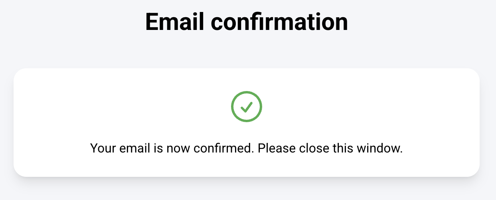
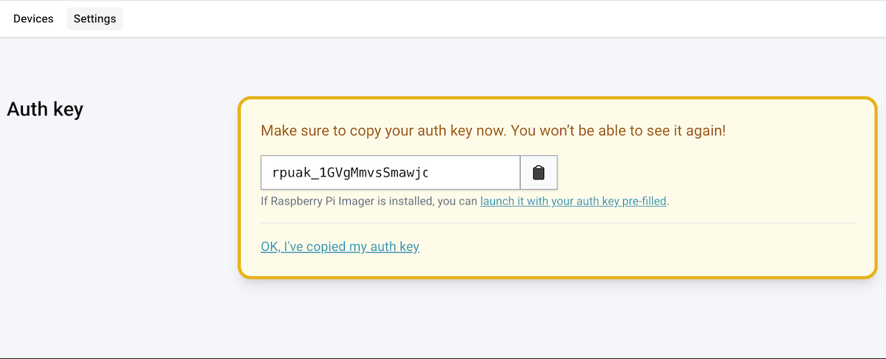
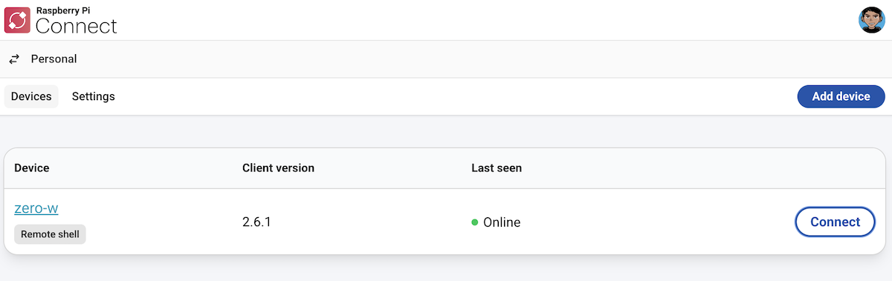

Mengakses [Raspberry Pi](https://www.raspberrypi.com/) dari jaringan lokal memang sudah menjadi hal biasa. Namun, menjadi tantangan jika perangkat berada di lokasi terpisah, berada di balik NAT, atau tidak memiliki IP publik. Dalam kondisi seperti ini, [Raspberry Pi Connect](https://www.raspberrypi.com/software/connect/) bisa menjadi solusi yang sangat membantu.

Bagi penulis, layanan ini terasa seperti solusi yang elegan untuk tetap terhubung dengan Raspberry Pi kapan pun dibutuhkan, tanpa harus dipusingkan konfigurasi jaringan yang kompleks.

## Apa Itu Raspberry Pi Connect?

Raspberry Pi Connect merupakan layanan resmi dari Raspberry Pi yang memungkinkan pengguna mengakses perangkat Raspberry Pi mereka secara *remote* melalui internet. Layanan ini dirancang agar tetap mudah digunakan, termasuk pada Raspberry Pi OS Lite yang tidak memiliki tampilan desktop.

Hal ini menjadikan Raspberry Pi Connect sangat cocok untuk penggunaan server kecil, node IoT, atau perangkat *headless* yang berjalan terus-menerus tanpa monitor.

## Membuat Raspberry Pi ID

Sebelum menggunakan Raspberry Pi Connect, pengguna perlu memiliki Raspberry Pi ID. Akun ini berfungsi sebagai identitas untuk menghubungkan perangkat dengan layanan Raspberry Pi.

Proses pembuatannya cukup sederhana:



1. Mengisikan email

2. Menentukan password

3. Mengisi nama pengguna

4. Melakukan konfirmasi melalui email



Setelah proses tersebut selesai, akun Raspberry Pi ID sudah siap digunakan.

## Membuat *Auth Key*

Karena Raspberry Pi yang digunakan tidak memiliki antarmuka desktop, proses autentikasi salah satunya dilakukan menggunakan *Auth Key*.




*Auth Key* dibuat melalui *dashboard* Raspberry Pi Connect menggunakan akun Raspberry Pi ID. Kunci ini nantinya digunakan untuk menghubungkan perangkat Raspberry Pi melalui *command line interface* (CLI).

## Menghubungkan Raspberry Pi ke Raspberry Pi Connect

Setelah *Auth Key* tersedia, proses menghubungkan perangkat menjadi sangat singkat. Jalankan perintah berikut di device Raspberry Pi Anda:

```bash
rpi-connect on
rpi-connect signin --auth-key=<auth_key>
```

Pendekatan ini sangat cocok untuk Raspberry Pi OS Lite atau sistem *headless* tanpa GUI. Dalam hitungan detik, perangkat sudah terdaftar dan siap diakses secara *remote*.



Untuk konfigurasi melalui desktop dan dokumentasi lengkap dapat dilihat pada [halaman in](https://www.raspberrypi.com/documentation/services/connect.html)

## Skema Penggunaan Personal dan Organisasi

Raspberry Pi Connect menyediakan dua skema penggunaan. Untuk penggunaan personal, layanan ini dapat digunakan secara gratis. Pengguna individu dapat mengelola dan mengakses perangkat Raspberry Pi miliknya tanpa biaya tambahan.

Sementara itu, untuk penggunaan organisasi, tersedia fitur Connect for Organisations. Fitur ini memungkinkan:

- Akses perangkat dibagikan ke beberapa pengguna

- Manajemen perangkat dalam satu organisasi

- Kolaborasi tim dalam mengelola Raspberry Pi

Saat sebuah organisasi dibuat, layanan ini otomatis mendapatkan masa uji coba gratis selama empat minggu. Setelah masa *trial* berakhir, biaya yang dikenakan adalah 0,5 dolar per *device* per bulan, tergolong sangat terjangkau untuk kebutuhan tim atau institusi.

## Kelebihan Raspberry Pi Connect

Beberapa kelebihan Raspberry Pi Connect antara lain:

- Gratis untuk penggunaan personal

- Mendukung kolaborasi tim melalui Connect for Organisations

- Tidak memerlukan port forwarding

- Cocok untuk perangkat desktop maupun headless

- Layanan resmi dari Raspberry Pi

- Proses setup cepat dan minim konfigurasi

Bagi penulis, ini adalah solusi praktis tanpa harus berurusan dengan konfigurasi server, VPN atau pengaturan firewall manual.

## Kesimpulan

Raspberry Pi Connect menawarkan cara yang praktis dan modern untuk mengakses Raspberry Pi dari mana saja. Mulai dari pengguna personal hingga organisasi, semuanya difasilitasi dengan skema yang jelas dan mudah digunakan. Dengan biaya 0,5 dolar per *device* per bulan untuk organisasi (dengan masa trial gratis). Raspberry Pi Connect menjadi pilihan yang sangat masuk akal bagi siapa pun yang ingin mengelola Raspberry Pi secara *remote* dengan aman, mudah, dan minim konfigurasi.