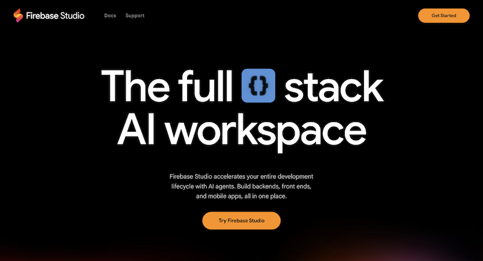
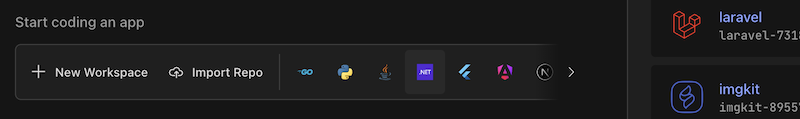
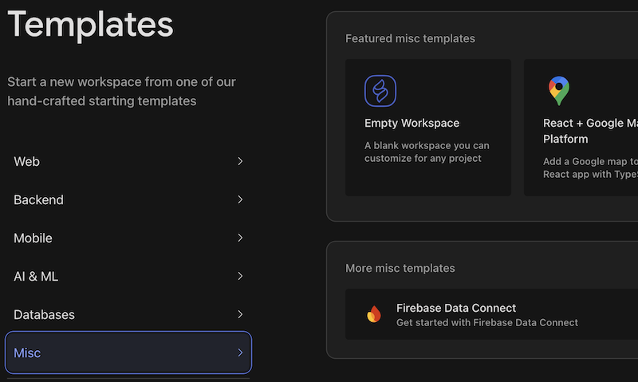
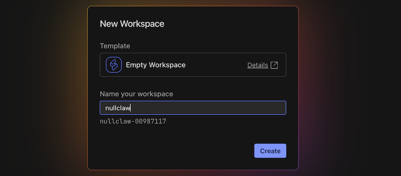
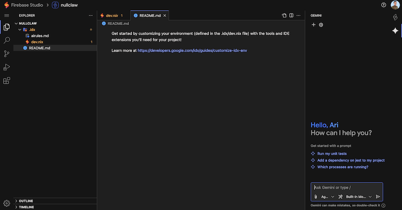
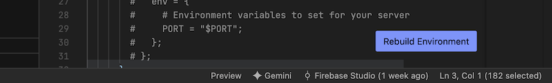
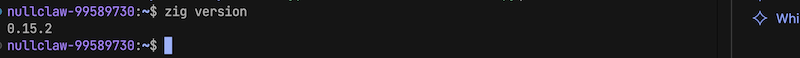
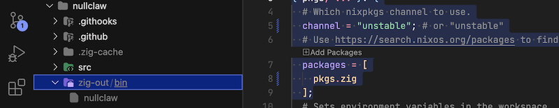
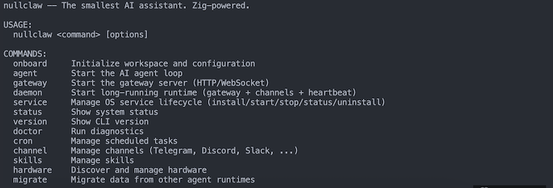

Raspberry Pi Zero W mulai dilupakan karena spesifikasi yang minimalis. Dengan makin banyaknya asisten AI yang mulai fokus pada kecepatan dan kesederhanaan, perangkat ini dapat dimanfaatkan kembali. Namun, tidak semua menyediakan *prebuilt* *binary* untuk Raspberry Pi Zero W yang berbasis ARMv6 32-bit. Artikel ini membahas bagaimana membangun NullClaw dari kode sumber yang bisa berjalan di Raspberry Pi Zero W.

## Apa Itu NullClaw?

[NullClaw](https://github.com/nullclaw/nullclaw) adalah proyek asisten AI *open-source* yang berfokus pada implementasi sistem *automation/agent* yang ringan dan efisien. Dibangun dengan bahasa pemrograman [Zig](https://ziglang.org), proyek ini dirancang untuk berjalan sebagai service minimalis dengan dependensi kecil, sehingga cocok untuk *container* maupun perangkat dengan sumber daya terbatas.

## Apa Itu Firebase Studio?

[Firebase Studio](https://firebase.studio) adalah *environment* pengembangan berbasis *cloud* yang menyediakan *workspace* instan untuk coding dan *build* *project* tanpa harus menginstal *toolchain* di perangkat lokal. Firebase Studio dibangun dibangun menggunakan [Nix](https://nixos.org) sehingga mudah untuk menyiapkan kebutuhan untuk *build*. Selain itu, proses *build* dapat dilakukan lebih cepat dan bersih, kemudian hasil *binary* bisa ditransfer ke Raspberry Pi Zero W.



## Build NullClaw untuk Raspberry Pi Zero W

### Langkah 1: Buat Project Baru

Masuk ke [Firebase Studio](https://firebase.studio) dan buat *workspace* baru dengan menekan menu **New Workspace**.



Pada halaman **Templates**, pilih kategori **Misc** lalu buat **Empty Workspace**.



Isi nama *workspace*, lalu tekan **Create**.



Jika berhasil akan tampil halaman editor Firebase Studio.



### Langkah 2: Memasang Zig

Sesuaikan pengaturan pada berkas `dev.nix` untuk menggunakan nix packages terbaru dan memasang aplikasi `zig`.

```nix
{ pkgs, ... }: {
  # Which nixpkgs channel to use.
  channel = "unstable"; # or "unstable"
  # Use https://search.nixos.org/packages to find packages
  packages = [
    pkgs.zig
  ];
}
```

Agar perubahan diaplikasikan tekan tombol **Rebuild Environtment**.



Untuk menguji apakah `zig` sudah terpasang, buka terminal dari menu **File** > **Terminal** > **New Terminal**. Lalu ketikkan perintah:

```bash
zig version
```

Jika berhasil akan muncul versi `0.15.2`



## Langkah 3: Clone Kode Sumber

Pada terminal jalankan perintah di bawah ini

```bash
git clone https://github.com/nullclaw/nullclaw.git
```

Jika sudah selesai, masuk ke folder project dan memilih versi terbaru dengan menjalankan perintah:

```bash
cd nullclaw
git checkout v2026.2.21
```

## Langkah 4: Sesuaikan Kode untuk 32-bit

Dikarenakan arsitektur 32-bit belum didukung oleh NullClaw, beberapa kode perlu disesuaikan dengan menjalankan perintah:

```bash
find src -type f -name "*.zig" -exec sed -i 's/std.atomic.Value(u64)/std.atomic.Value(u32)/g' {} +
find src -type f -name "*.zig" -exec sed -i 's/std.atomic.Value(i64)/std.atomic.Value(u32)/g' {} +

sed -i 's/max_file_size: u64/max_file_size: u32/g' src/tools/file_read.zig

sed -i 's/std.time.timestamp()/@as(u32, @truncate(@as(u64, @intCast(std.time.timestamp()))))/g' src/channel_loop.zig

sed -i 's/ls.last_activity.store(std.time.timestamp(), .release);/ls.last_activity.store(@as(u32, @truncate(@as(u64, @intCast(std.time.timestamp())))), .release);/g' src/daemon.zig

sed -i 's/if (stat.size > self.max_file_size)/if (stat.size > @as(u64, self.max_file_size))/g' src/tools/file_read.zig
sed -i 's/file.readToEndAlloc(allocator, self.max_file_size)/file.readToEndAlloc(allocator, @as(usize, self.max_file_size))/g' src/tools/file_read.zig
```

## Langkah 5: Jalankan Build

Jika tidak ada *error* yang muncul dari langkah sebelumnya, lanjut dengan proses *build* dengan menjalankan perintah:

```bash
zig build -Dtarget=arm-linux-gnueabihf -Dcpu=arm1176jzf_s -Doptimize=ReleaseSmall
```

Proses membutuhkan waktu sekitar 5 menit. setelah berhasil berkas *binary* bisa dilihat pada folder `zig-out`.



Untuk mengunduh berkas, klik kanan pada berkas lalu pilih menu **Download...**


## Langkah 6: Uji Binary di Raspberry Pi Zero W

Untuk mentransfer *binary* ke Raspberry Pi Zero W bisa menggunakan perintah *scp*.

```bash
scp nullclaw user@192.168.1.10:~
```

> sesuaikan user dan aplamat ip sesuai perangkat dan jaringan yang dipakai

Setelah selesai, di Raspberry Pi Zero W jalankan perintah:

```bash
chmod +x nullclaw
./nullclaw
```

Jika tidak ada *error*, maka build sukses.



## Kesimpulan

NullClaw adalah proyek asisten AI *open-source* ringan yang cocok dijalankan pada Raspberry Pi Zero W. Karena belum tersedia *prebuilt* *binary* untuk ARMv6, proses *build* manual menjadi solusi paling aman dan stabil. Dengan bantuan *cloud* *environment* seperti Firebase Studio, proses kompilasi menjadi lebih praktis. Setelah *binary* dihasilkan dan diuji tanpa *error* di device, Raspberry Pi Zero W siap berperan sebagai asisten AI ringan berbasis NullClaw.
