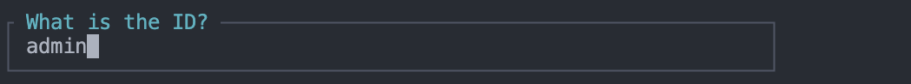

[Filament](https://filamentphp.com), dengan versi terakhir 3.1, semakin menjadi pilihan utama sebagai panel administrasi yang elegan dan sederhana untuk aplikasi Laravel. Dengan lebih dari sebelas ribu bintang di GitHub, menandakan Filament dipercaya oleh komunitas pengguna.

Dirancang khusus untuk memfasilitasi pengembangan dan manajemen aplikasi Laravel, Filament menyajikan antarmuka yang bersih dan responsif. Sebagai proyek berbasis Laravel, Filament bukan hanya sekadar panel administrasi, tetapi juga alat yang memperkaya pengalaman pengguna dalam mengelola berbagai aspek penting dari proyek mereka.

## Kelebihan

1. **Antarmuka Pengguna yang Bersih:** Filament menawarkan antarmuka yang bersih dan ramah pengguna, membuatnya mudah digunakan bahkan untuk pengembang pemula.

2. **Pengelolaan Data yang Efisien:** Dengan Filament, Anda dapat dengan mudah mengelola data aplikasi Anda, termasuk CRUD (Create, Read, Update, Delete) dengan sedikit usaha.

3. **Penyesuaian yang Mudah:** Filament menyediakan alat-alat konfigurasi dan penyesuaian untuk memastikan panel administrasi sesuai dengan kebutuhan proyek Anda.

4. **Integrasi yang Kuat dengan Laravel:** Sebagai bagian dari ekosistem Laravel, Filament menyatu secara mulus dengan framework, memanfaatkan fitur-fitur Laravel yang ada.

# Instalasi

Berikut adalah langkah-langkah untuk menginstal Filament di proyek Laravel Anda:

1. Tambahkan _package_ Filament:
   ```bash
   composer require filament/filament:"^3.1" -W
   ```

2. Lakukan instalasi Filament:
   ```bash
   php artisan filament:install --panels
   ```

3. Isikan dengan **admin** jika ada pertanyaan "What is the ID?"
   
4. Jalankan migrasi database:
   ```bash
   php artisan migrate
   ```

5. Buat user baru:
   ```bash
   php artisan make:filament-user
   ```

6. Buka browser dan akses panel administrasi Filament melalui URL proyek Anda (misalnya, `http://localhost/admin`).

## Kesimpulan

Dengan menginstal dan menggunakan Filament, Anda dapat meningkatkan efisiensi pengembangan dan pengelolaan aplikasi Laravel Anda. Panel administrasi yang bersih dan fungsional membuatnya menjadi pilihan yang solid untuk proyek-proyek berbasis Laravel. Dengan antarmuka yang ramah pengguna dan kelebihan-kelebihan yang ditawarkan, Filament dapat membantu mempercepat pengembangan aplikasi Anda.