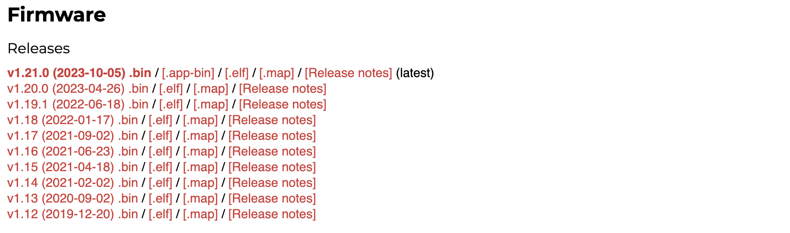

MicroPython adalah implementasi Python yang dirancang khusus untuk mikrokontroler dan perangkat _embedded_. Menginstal MicroPython pada _device_ adalah langkah pertama untuk memulai pengembangan proyek mikrokontroler dengan Python. Dalam panduan ini, kita akan membahas langkah-langkah instalasi MicroPython pada ESP32 Devkit V1.

## Persiapan yang Dibutuhkan

Sebelum Anda memulai, pastikan telah menyiapkan perangkat keras dan perangkat lunak berikut:

1. **ESP32 Devkit V1**: Pastikan Anda memiliki board ESP32 Devkit V1 yang akan digunakan untuk menginstal MicroPython. Atau Anda dapat membelinya [di sini](https://tokopedia.link/cNa9AwK5hEb)

2. **Kabel USB**: Anda memerlukan kabel USB untuk menghubungkan ESP32 ke komputer Anda.

3. **Komputer**: Anda akan memerlukan komputer atau laptop dengan port USB.

4. **Software esptool**: Pastikan Anda telah menginstal `esptool`, yang digunakan untuk mem-_flash_ firmware MicroPython ke ESP32. Anda dapat menginstalnya menggunakan perintah `pip`:

```bash
pip install esptool
```

Jika Anda gagal menjalankan perintah di atas. Pastikan Python sudah terinstall di komputer Anda.

## Langkah-langkah Instalasi

### 1. Unduh Firmware MicroPython

Pertama, unduh firmware MicroPython untuk ESP32 dari situs resmi MicroPython di [https://micropython.org/download/ESP32_GENERIC/](https://micropython.org/download/ESP32_GENERIC/). Pilih versi terakhir (_latest_).



### 2. Hubungkan ESP32 ke Komputer

Sambungkan ESP32 Devkit V1 ke komputer Anda menggunakan kabel USB. Pastikan bahwa _board_ terhubung dengan baik.

### 3. Identifikasi Port USB

Untuk mengidentifikasi port USB yang digunakan oleh ESP32, Anda dapat menjalankan perintah berikut di terminal (Linux/macOS) atau Command Prompt (Windows):

```bash
esptool.py --port /dev/ttyUSB0 flash_id
```

Pastikan untuk mengganti `/dev/ttyUSB0` dengan port USB yang sesuai pada sistem Anda.

### 4. Flash Firmware MicroPython

Jika Anda memasang MicroPython di _board_ untuk pertama kalinya, maka terlebih dahulu hapus seluruh _flash_ menggunakan perintah:

```bash
esptool.py --chip esp32 --port /dev/ttyUSB0 erase_flash
```

Gunakan `esptool` untuk mem-_flash_ firmware MicroPython ke ESP32. Gantilah `<firmware.bin>` dengan nama file firmware MicroPython yang telah Anda unduh:

```bash
esptool.py --chip esp32 --port /dev/ttyUSB0 --baud 460800 write_flash -z 0x1000 <firmware.bin>
```

Pastikan untuk mengganti `/dev/ttyUSB0` dengan port USB yang sesuai pada sistem Anda dan `<firmware.bin>` dengan nama file firmware yang sesuai.

Pada saat tulisan ini dibuat versi MicroPython yang digunakan adalah __v1.21.0 (2023-10-05) .bin__

### 5. Selesai!

Setelah proses flashing selesai, Anda telah berhasil menginstal MicroPython pada ESP32 Devkit V1. Anda sekarang dapat menggunakan MicroPython untuk mengembangkan proyek-proyek pada _board_ tersebut.

## Kesimpulan

Instalasi MicroPython pada ESP32 Devkit V1 adalah langkah awal yang penting untuk memulai pengembangan proyek mikrokontroler dengan Python. Dengan mengikuti panduan ini, Anda telah berhasil menginstal MicroPython pada ESP32 Devkit V1 dan siap untuk memulai pengembangan proyek Anda dengan bahasa pemrograman Python yang familiar. Selamat mencoba!

## Referensi

[MicroPython for ESP32 / WROOM](https://micropython.org/download/ESP32_GENERIC/)