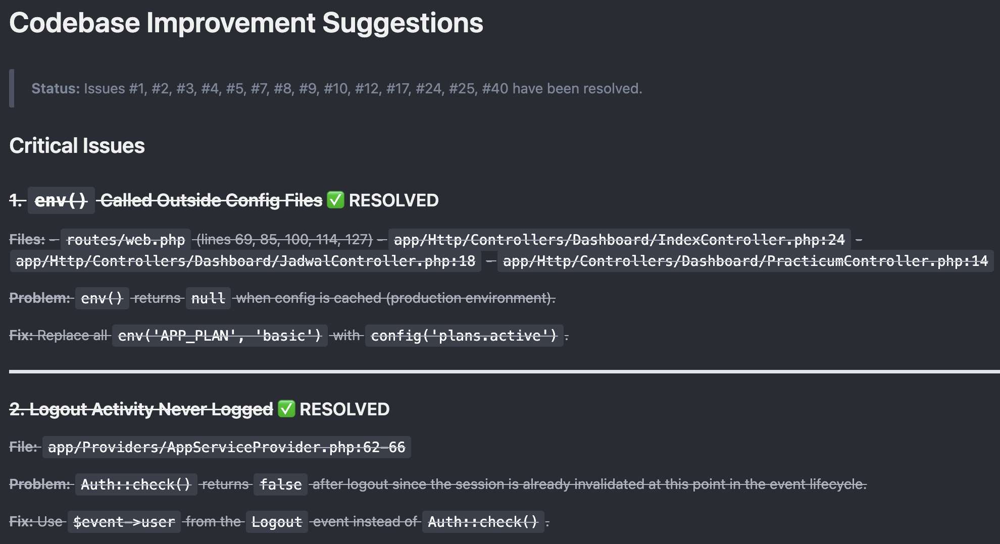

Pernah gak sih lagi asyik ngoding bareng AI, tiba-tiba jawabannya jadi ngaco atau "lupa" sama kode yang baru dibahas? Masalah klasik ini biasanya muncul karena kita terlalu sering pakai metode sekali _prompt_ atau _One-Shot Prompting_ seperti __C.R.E.A.T.E.__

Meskipun metode itu bagus untuk membuat perintah lengkap, kendalanya muncul kalau kita pakai [OpenCode](https://opencode.ai/) versi _free_. Di sana jumlah token sangat terbatas. Kalau kita kirim instruksi raksasa terus-menerus, kuota token cepat habis dan AI malah jadi bingung karena kebanyakan informasi. Berangkat dari masalah itu, saya mencoba cara baru yang lebih bertahap dan teratur terinspirasi dari metode _Plan_ dan _Tasks_ di Google [Antigravity](https://antigravity.google/) dan _Spec-Driven Development_ di [Kiro](https://kiro.dev/). Saya menyebutnya __L.E.V.A.__

## Apa itu L.E.V.A?

Singkatnya, L.E.V.A (_List_, _Execute_, _Validate_, _Adjust_) adalah cara kita ngobrol sama AI supaya dia punya "catatan perkembangan". Daripada minta dia hafal semua kode, kita gunakan berkas Markdown eksternal buat jadi panduan bersama agar AI tetap nyambung sama progres kita tanpa harus kirim ulang semua penjelasan dari awal. Saya sudah tes metode ini di Laravel untuk tiga hal: improvisasi kode (Improve), membuat _Feature_ dan _Unit_ tests, hingga menambah fitur baru. Hasilnya jauh lebih stabil dan efisien!

## Cara Kerja L.E.V.A

Daripada menyuruh AI mengerjakan semuanya sekaligus, kita bagi tugasnya jadi empat tahap sederhana:

### 1. List (Bikin Daftar Tugas)

Anggap saja ini tahap pemetaan. Jangan suruh AI menulis kode dulu. Kasih kode kalian dan minta dia jadi auditor buat cari celah.

- __Aksi__: AI diminta membuat daftar saran atau rencana kerja dalam file `suggests.md` atau `tasks.md`.

- __Manfaat__: Kita punya daftar tugas yang jelas. AI gak bakal menebak-nebak lagi karena semua rencana sudah tertulis rapi di file itu.

- __Contoh Prompt__: _"Analisa codebase Laravel ini (lampirkan kode Controller/Model). Identifikasi potensi bug, n+1 query, dan perbaikan struktur, lalu simpan hasilnya dalam daftar tugas di berkas suggests.md."_

### 2. Execute (Kerjakan Satu Per Satu)

Sekarang bagian eksekusi, tapi kuncinya adalah: fokus pada satu hal saja.

- __Aksi__: Suruh AI mengerjakan satu nomor dari daftar tadi.

- __Manfaat__: AI jadi super fokus dan akurasinya meningkat tajam. Karena jawabannya pendek dan spesifik, token yang dipakai pun jadi jauh lebih dikit.

- __Contoh Prompt__: _"Proses usulan nomor satu yang ada di daftar suggests.md. Tuliskan kode perbaikannya saja."_

### 3. Validate (Cek Dulu Kodenya)

Pada tahap ini giliran kita yang bekerja. Kita tidak harus memakai _prompt_.

- __Aksi__: Jalankan `php artisan test`, atau cek manual apakah kodenya sudah benar.

- __Manfaat__: Memastikan fondasi kodenya sudah kokoh sebelum kita tambah dengan fitur baru. Gak mau kan, fitur baru jalan tapi fitur lama malah rusak?

### 4. Adjust (Update Catatan atau Lanjut)

Terakhir, kita sinkronkan lagi rencana kita dengan apa yang sudah terjadi di lapangan.

- __Aksi__: Tandai tugas yang sudah selesai di file Markdown. Kalau ada kendala baru, tambahkan ke list.

- __Manfaat__: Alur kerja jadi terus maju dan terorganisir. Kita dan AI selalu di tahap yang sama.

- __Contoh Prompt__: _"Poin nomor satu sudah berhasil diimplementasikan. Sekarang update status di suggests.md menjadi selesai, lalu lanjut kerjakan poin nomor dua: implementasikan resources pada route."_

## Kesimpulan

Bagi saya, __L.E.V.A__ mengubah AI dari sekadar "mesin penjawab" yang boros token jadi "asisten pengembang" yang benar-benar tahu urutan kerja. Dengan memisahkan tahap perencanaan (_List_) dan eksekusi (_Execute_), kita bisa memaksimalkan penggunaan token di OpenCode Free yang terbatas dan tetap mendapat kualitas kode yang baik.

Bagaimana? Tertarik untuk coba L.E.V.A di proyek kalian?