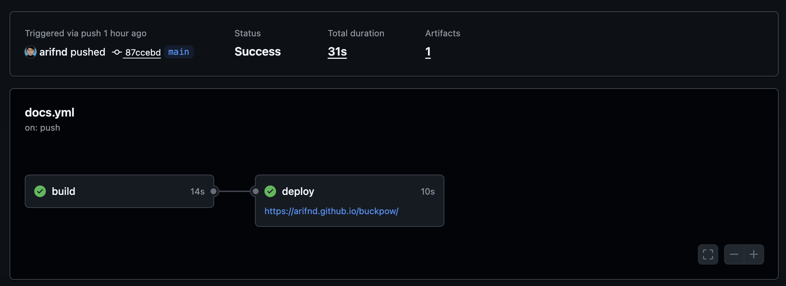

Selama beberapa minggu terakhir penulis mengembangkan [BuckPow](https://github.com/arifnd/buckpow), sebuah platform *open source* untuk *energy observability* dan *benchmarking* perangkat IoT serta *embedded system*. Saat ini repository tidak hanya berisi aplikasi *backend* berbasis Python, tetapi juga *firmware* untuk ESP8266/ESP32, dashboard web, REST API, contoh implementasi, hingga dokumentasi perangkat keras. Pada awal pengembangan, seluruh informasi penulis tampilkan di dalam `README.md`. Cara tersebut cukup efektif ketika proyek masih sederhana. Namun, setelah setelah beta rilis pertama, README mulai terasa kurang untuk menampung semua informasi mengenai proyek. Sehingga penulis mulai kesulitan menjaga dokumentasi untuk tetap rapi, pada kondisi tersebut penulis menyadari bahwa dokumentasi tidak bisa lagi diperlakukan sebagai lampiran proyek. Dokumentasi harus menjadi bagian dari proses pengembangan.

## Mengapa Dokumentasi Penting?

Awalnya penulis menganggap dokumentasi adalah pekerjaan terakhir setelah semua fitur selesai dibuat. Namun, semakin besar proyek berkembang, semakin besar pula kebutuhan akan dokumentasi yang baik. Dokumentasi membantu berbagai jenis pengguna dengan kebutuhan yang berbeda.

* Pengguna baru ingin menjalankan aplikasi dengan cepat.
* Peneliti membutuhkan langkah eksperimen yang dapat direproduksi.
* Kontributor ingin memahami struktur proyek sebelum mulai menulis kode.
* Maintainer membutuhkan referensi ketika kembali membuka proyek beberapa bulan kemudian.

Semua kebutuhan tersebut sebenarnya dapat dipenuhi melalui dokumentasi yang terstruktur. Dokumentasi bukan hanya menjelaskan perangkat lunak. Dokumentasi membuat perangkat lunak menjadi dapat digunakan.

## Memilih Teknologi

Penulis menetapkan beberapa kriteria sebelum memilih platform dokumentasi.

* Berbasis Markdown
* Mudah dipelihara
* Gratis untuk di-host
* Memiliki fitur pencarian
* Mendukung dark mode
* Mudah dikembangkan oleh kontributor
* Terintegrasi dengan GitHub

Setelah membandingkan beberapa alternatif, penulis memilih kombinasi berikut.

| Komponen              | Teknologi           |
| --------------------- | ------------------- |
| Static Site Generator | MkDocs              |
| Tema                  | Material for MkDocs |
| Hosting               | GitHub Pages        |
| CI/CD                 | GitHub Actions      |
| Konten                | Markdown            |

Seluruh dokumentasi berada di *repository* yang sama dengan *source code* sehingga setiap perubahan kode dapat disertai perubahan dokumentasi dalam satu *Pull Request*. Sehingga penulis belajar pendekatan ini yang dikenal sebagai **Documentation as Code**. Artinya dokumentasi diperlakukan sama pentingnya dengan source code.

## Struktur Dokumentasi

Daripada membuat README yang sangat panjang, penulis membaginya menjadi beberapa bagian sesuai kebutuhan pengguna.

```
docs/

├── index.md
├── quick-start.md

├── user-guide/
│   ├── installation.md
│   ├── dashboard.md
│   ├── devices.md
│   ├── benchmark.md

├── developer-guide/
│   ├── architecture.md
│   ├── api.md
│   ├── database.md
│   ├── firmware.md

└── blog/
```

Masing-masing bagian memiliki tujuan yang berbeda.

* **Quick Start** membantu pengguna menjalankan BuckPow dalam beberapa menit.
* **User Guide** menjelaskan penggunaan aplikasi.
* **Developer Guide** menjelaskan desain sistem.
* **Blog** berisi engineering journal dan keputusan desain selama pengembangan.

Dengan struktur seperti ini, setiap jenis pembaca dapat langsung menuju informasi yang dibutuhkan tanpa harus membaca seluruh dokumentasi.

## Deploy Otomatis Menggunakan GitHub Actions



Salah satu alasan utama penulis memilih MkDocs adalah proses deployment yang sangat sederhana. Setiap perubahan pada branch utama akan memicu GitHub Actions. Workflow tersebut secara otomatis membangun dokumentasi dan mempublikasikannya ke GitHub Pages. Dengan pendekatan ini penulis tidak perlu lagi mengunggah file HTML secara manual ataupun mengelola server web. Repository menjadi satu-satunya *single source of truth* baik untuk kode maupun dokumentasi.

## Pelajaran yang Penulis Dapat

Setelah memindahkan dokumentasi ke MkDocs, penulis merasakan beberapa manfaat yang sebelumnya tidak terlpernah terpikirkan.

* README menjadi jauh lebih ringkas.
* Dokumentasi lebih mudah dicari.
* Setiap fitur baru langsung memiliki halaman dokumentasi sendiri.
* Kontributor memiliki referensi yang lebih jelas.
* Struktur proyek menjadi lebih konsisten.
* Dokumentasi dan *source code* selalu berada dalam versi yang sama.

Yang lebih penting, proses membuat dokumentasi membantu penulis melihat proyek dari sudut pandang pengguna, bukan hanya sebagai pengembang.

## Penutup

Membangun dokumentasi ternyata bukan sekadar membuat website untuk menyimpan panduan penggunaan. Dokumentasi adalah bagian dari proses *software engineering*. Ia membantu pengguna memahami proyek, mempermudah kontributor untuk mulai berpartisipasi, sekaligus memaksa maintainer mengevaluasi kembali desain sistem yang telah dibuat.

Bagi penulis, kombinasi **MkDocs**, **Material for MkDocs**, **GitHub Pages**, dan **GitHub Actions** memberikan solusi yang sederhana namun sangat efektif. Seluruh dokumentasi ditulis menggunakan Markdown, disimpan bersama *source code*, dan dipublikasikan secara otomatis setiap kali ada perubahan.

Pada akhirnya, proyek open source yang baik bukan hanya proyek yang memiliki banyak fitur, tetapi juga proyek yang dapat dipahami oleh siapa pun yang ingin menggunakannya atau ikut mengembangkannya.

## Referensi

* [MkDocs](https://www.mkdocs.org/)
* [Material for MkDocs](https://squidfunk.github.io/mkdocs-material/)
* [GitHub Pages](https://docs.github.com/en/pages)
* [GitHub Actions](https://github.com/features/actions)