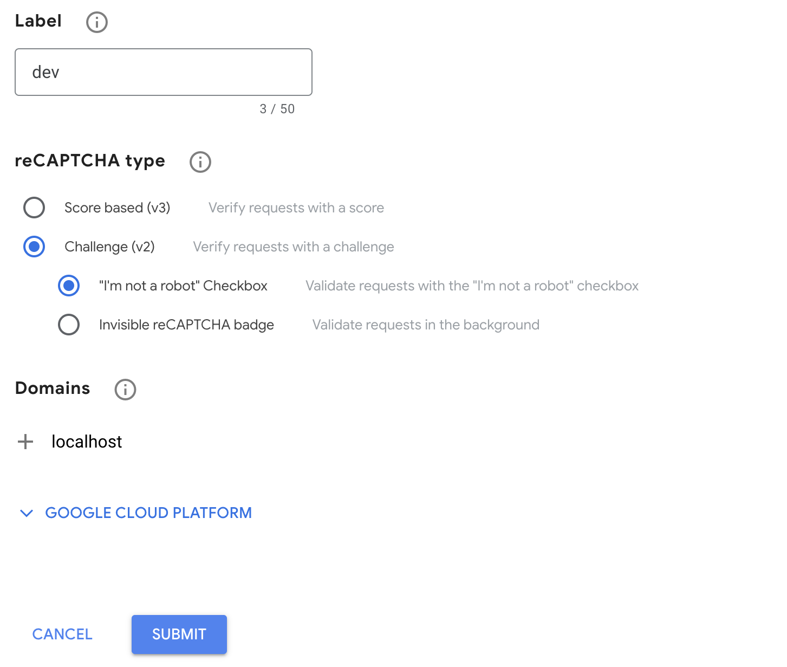
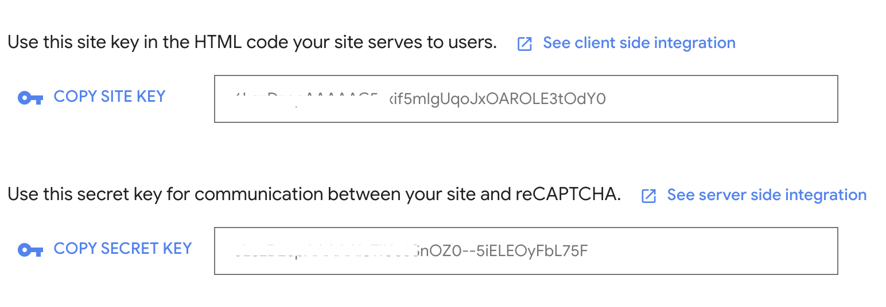

Keamanan situs web merupakan sebuah prioritas, terutama mengenai halaman login. Dalam panduan ini, kita akan membahas langkah-langkah untuk memasang Google reCAPTCHA v2 pada halaman login Filament, sebagai lapisan keamanan tambahan.

## Apa itu Google reCAPTCHA v2?

Google reCAPTCHA v2 adalah layanan keamanan yang membantu membedakan antara akses otomatis (bot) dan interaksi manusia di situs web. Dengan memasangnya pada halaman login Filament, Anda dapat melindungi akun pengguna dari serangan _brute force_ dan aktivitas berbahaya.

## Mengapa Harus Menggunakan Google reCAPTCHA?

- **Pencegahan Serangan Brute Force**: Melindungi halaman login dari serangan percobaan masuk otomatis.

- **Perlindungan Terhadap Spam: Mencegah** penggunaan bot untuk mengirimkan formulir login dengan informasi palsu.

## Langkah-langkah

Berikut ini langkah-langkah untuk memasang Google reCAPTCHA v2 pada halaman login Filament menggunakan _plugin_ [Google reCaptcha V2 field](https://filamentphp.com/plugins/abanoub-nassem-grecaptcha-field).

### Langkah 1: Mendapatkan SITE KEY dan SECRET KEY

1. Akses alamat https://www.google.com/recaptcha/admin dari _browser_ Anda.

2. Tekat tombol **+** (_create_), lalu isikan **Label**, **reCAPTCHA type**, **Domains** Setelah selesai tekan tombol **SUBMIT**.

   

   Untuk domain isikan **localhost** jika anda melakukan pengujian secara lokal.

3. Setelah itu simpan **SITE KEY** dan **SECRET KEY**.

   

### Langkah 2: Memasang Google reCaptcha V2 field

1. Pasang _plugin_ dengan menjalankan perintah:

```bash
composer require abanoubnassem/filament-grecaptcha-field
```

2. _Publish_ berkas konfigurasi dengan menjalankan perintah:

```bash
php artisan vendor:publish --provider="Anhskohbo\NoCaptcha\NoCaptchaServiceProvider"
```

3. tambahkan pengaturan **NOCAPTCHA_SECRET** dan **NOCAPTCHA_SITEKEY** pada berkas `.env` Anda:

```ini
NOCAPTCHA_SECRET=secret-key
NOCAPTCHA_SITEKEY=site-key
```

Sesuaikan **secret-key** dan **site-key** sesuai dengan langkah 1.

4. Buat berkas `app/Filament/Pages/Auth/Login.php` dan isi dengan kode di bawah:

```php
<?php

namespace App\Filament\Pages\Auth;

use AbanoubNassem\FilamentGRecaptchaField\Forms\Components\GRecaptcha;
use Filament\Forms\Form;

class Login extends \Filament\Pages\Auth\Login
{
    public function form(Form $form): Form
    {
        return $form
            ->schema([
                $this->getEmailFormComponent(),
                $this->getPasswordFormComponent(),
                $this->getRememberFormComponent(),
                GRecaptcha::make('captcha'),
            ])
            ->statePath('data');
    }
}
```

5. Modifikasi berkas `app/Providers/Filament/AdminPanelProvider.php` menjadi seperti di bawah ini:

```php
<?php

namespace App\Providers\Filament;

use App\Filament\Pages\Auth\Login;
....

class AdminPanelProvider extends PanelProvider
{
    public function panel(Panel $panel): Panel
    {
        return $panel
            ...
            ->login(Login::class)
            ...
```

Sesuaikan berkas _provider_ `AdminPanelProvider.php` sesuai panel yang Anda miliki.

6. Akses proyek Anda dari _browser_.

## Kesimpulan

Menambahkan Google reCAPTCHA v2 pada halaman login Filament adalah salah satu langkah untuk meningkatkan keamanan dan melindungi situs web Anda dari ancaman brute force , bot dan serangan spam. Dengan mengikuti panduan ini, Anda dapat dengan mudah mengintegrasikan lapisan keamanan tambahan ke halaman login Filament Anda, memastikan bahwa hanya interaksi manusia yang dapat mengaksesnya.