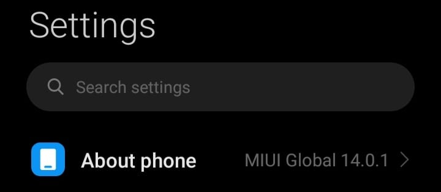
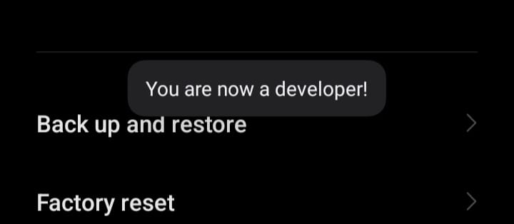

## Pengantar

Bagi pengembang aplikasi Android, melakukan *debug* aplikasi di emulator membutuhkan *resource* yang cukup besar, setidaknya membutuhkan RAM sebanyak 16 GB[^1]. Selain itu, ada solusi melakukan *debug* aplikasi langsung ke *device* Android yang dimiliki. Agar *device* Android bisa digunakan untuk melakukan *debug* perlu mengaktifkan *Developer options*. 

Berikut ini langkah-langkah untuk mengaktifkan *Developer options* pada *device* Android yang menggunakan UI MIUI versi 14:

## Langkah-Langkah

1. Buka Halaman **Settings**.


2. Pilih Menu **About Phone**.


3. Klik MIUI Version sebanyak **tujuh** kali, hingga muncul peringatan ```You are now a developer!```.



4. Kembali ke halaman **Settings**, buka menu **Additional Settings**. 


5. Jika muncul menu **Developer options** berarti *Developer options* pada *device* Android sudah aktif.


## Kesimpulan

Dengan aktifnya *Developer options* pada *device* Android, proses *debug* bisa dilakukan langsung ke *device* Android yang dimiliki melalui kabel data maupun WiFi (untuk Android versi 11 ke atas).

## Referensi

[^1]: [Run apps on the Android Emulator](https://developer.android.com/studio/run/emulator#:~:text=a%20physical%20device.-,Emulator%20system%20requirements,16%20GB%20disk%20space)