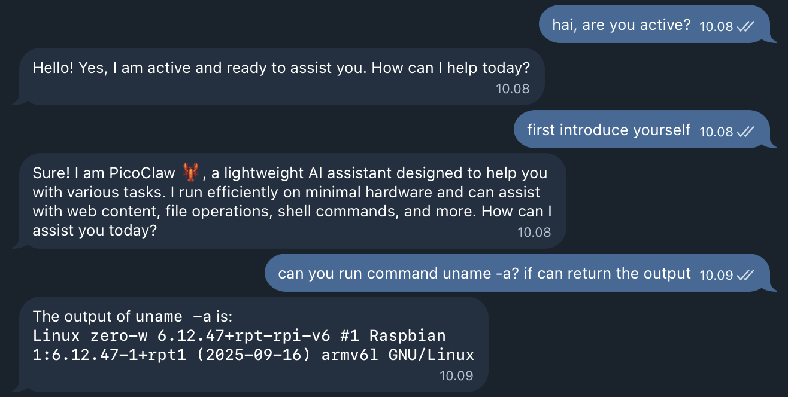

Raspberry Pi Zero W merupakan *Single Board Computer* (SBC) mungil dengan konsumsi daya rendah, tetapi cukup tangguh untuk berbagai automasi dan layanan ringan. Dengan adanya [PicoClaw](https://picoclaw.io), perangkat ini bisa menjadi asisten AI kecil berbasis Telegram yang selalu aktif 24 jam. Hal ini memungkinkan karena PicoClaw menggunakan Golang sehingga dapat di-*compile* menjadi file *binary*. Dengan ukuran aplikasi sekitar 8 MB dan kebutuhan ram mulai dari 10 MB menjadikan PicoClaw cocok dijalankan di Raspberry Pi Zero W.

Artikel ini membahas cara menjalankan PicoClaw di Raspberry Pi Zero W dengan sistem operasi Debian 13, mulai dari instalasi hingga konfigurasi otomatis saat restart.

> Pastikan Raspberry Pi Zero W sudah terpasang Raspberry Pi OS terbaru dan memiliki koneksi internet yang stabil sebelum memulai.

## Langkah 1: Unduh *Precompiled Binary*

Unduh berkas *binary* yang sudah dikompilasi untuk arsitektur ARMv6 (sesuai dengan Raspberry Pi Zero W) dengan menjalankan perintah:

```bash
wget https://github.com/sipeed/picoclaw/releases/download/v0.1.2/picoclaw_Linux_armv6.tar.gz
```

Pastikan file yang diunduh bernama `picoclaw_Linux_armv6.tar.gz`

Untuk memastikan arsitektur sesuai, jalankan:

```bash
uname -m
```

Raspberry Pi Zero umumnya menggunakan `armv6` atau `armv6l`.

## Langkah 2: Ekstrak File

Masuk ke direktori tempat file diunduh, lalu jalankan:

```bash
tar zxvf picoclaw_Linux_armv6.tar.gz
```

Perintah tersebut akan mengekstrak file *binary* PicoClaw.

Agar lebih rapi, penulis biasanya membuat folder khusus, misalnya:

```bash
mkdir -p ~/apps/picoclaw
mv picoclaw ~/apps/picoclaw
cd ~/apps/picoclaw
chmod +x picoclaw
```

## Langkah 3: Jalankan Perintah *Onboard*

Sebelum dijadikan *gateway*, jalankan proses *onboard* terlebih dahulu:

```bash
./picoclaw onboard
```

Proses ini akan membuat struktur folder konfigurasi di *home* direktori `~/.picoclaw/`

Jika tidak ada error, akan tampil pesan seperti di bawah ini.

```bash
🦞 picoclaw is ready!

Next steps:
  1. Add your API key to /home/user/.picoclaw/config.json
     Get one at: https://openrouter.ai/keys
  2. Chat: picoclaw agent -m "Hello!"
```

## Langkah 4: Edit File Konfigurasi

Buka file konfigurasi:

`nano ~/.picoclaw/config.json`

Di dalam file tersebut, sesuaikan beberapa bagian penting:

`agents`

```json
  "agents": {
    "defaults": {
      "workspace": "~/.picoclaw/workspace",
      "restrict_to_workspace": true,
      "provider": "ISI_AI_PROVIDER_ANDA",
      "model": "ISI_MODEL_YANG_DIGUNAKAN",
      "max_tokens": 8192,
      "temperature": 0.7,
      "max_tool_iterations": 20
    }
  }
```

`channels`
```json
  "channels": {
    "telegram": {
      "enabled": true,
      "token": "ISI_DENGAN_TOKEN_BOT_ANDA",
      "proxy": "",
      "allow_from": ["123456789"]
    },
```

> untuk membuat Telegram Bot bisa membuka [@BotFather](https://telegram.me/BotFather), dan pastikan memeiliki tanda centang biru.

`providers`
```
  "providers": {
    "openai": {
      "api_key": "",
      "api_base": "https://api.openai.com/v1"
    },
```

> Penulis menggunakan provider dari OpenAi, Pico claw mendukung beberapa provider diantaranya anthropic, openrouter, groq, zhipu, vllm, gemini, nvidia, ollama, moonshot, shengsuanyun, deepseek, github_copilot

Setelah selesai, simpan dengan tekan `CTRL` + `O`, lalu tekan `Enter` kemudian tekan `CTRL` + `X`.

## Langkah 5: Jalankan Gateway

Setelah konfigurasi selesai, jalankan *mode* *gateway*:

```bash
./picoclaw gateway
```

Jika berhasil akan tampil pesan seperti di bawah, jika demikian PicoClaw akan mulai aktif dan siap menerima pesan dari Telegram.

```bash
📦 Agent Status:
  • Tools: 12 loaded
  • Skills: 6/6 available
2026/02/22 10:54:29 [2026-02-22T03:54:29Z] [INFO] agent: Agent initialized {tools_count=12, skills_total=6, skills_available=6}
2026/02/22 10:54:29 [2026-02-22T03:54:29Z] [INFO] channels: Initializing channel manager
2026/02/22 10:54:29 [2026-02-22T03:54:29Z] [INFO] channels: Telegram channel enabled successfully
2026/02/22 10:54:29 [2026-02-22T03:54:29Z] [INFO] channels: Channel initialization completed {enabled_channels=1}
✓ Channels enabled: [telegram]
✓ Gateway started on 0.0.0.0:18790
Press Ctrl+C to stop
```

## Langkah 6: Uji Bot Telegram

Buka aplikasi Telegram, lalu kirim pesan ke bot yang sudah dibuat menggunakan token yang dimasukkan pada konfigurasi. Jika konfigurasi benar, *bot* akan merespons sesuai model dan provider yang digunakan. 



Pada tahap ini, Raspberry Pi Zero W sudah menjadi asisten AI mini yang berjalan secara mandiri.

## Langkah 7: Menjalankan PicoClaw Otomatis Saat Boot

Agar PicoClaw berjalan otomatis setiap kali Raspberry Pi Zero W dinyalakan atau *restart*, gunakan *systemd service*.

Buat file service baru:

```bash
sudo nano /etc/systemd/system/picoclaw.service
```

Isi dengan konfigurasi berikut (sesuaikan path jika berbeda):

```ini
[Unit]
Description=PicoClaw Gateway Service
After=network.target

[Service]
Type=simple
User=pi
WorkingDirectory=/home/pi/apps/picoclaw
ExecStart=/home/pi/apps/picoclaw/picoclaw gateway
Restart=always
RestartSec=5

[Install]
WantedBy=multi-user.target
```

Catatan penting:

- Ganti `pi` dengan *username* yang digunakan jika berbeda.

- Pastikan *path* sesuai dengan lokasi *binary*.

Simpan dan keluar.

## Langkah 8: Reload dan Aktifkan Service

Jalankan perintah berikut:

```bash
sudo systemctl daemon-reload
sudo systemctl enable picoclaw
sudo systemctl start picoclaw
```

Untuk memastikan service berjalan:

```bash
sudo systemctl status picoclaw
```

Jika status menunjukkan `active (running)` seperti di bawah, maka PicoClaw sudah berjalan otomatis sebagai service.

```bash
● picoclaw.service - PicoClaw Gateway Service
     Loaded: loaded (/etc/systemd/system/picoclaw.service; enabled; preset: enabled)
     Active: active (running) since Sun 2026-02-22 11:07:20 WIB; 20s ago
 Invocation: 12bcfb1264464a36968d58b990fbafbe
   Main PID: 1545 (picoclaw)
      Tasks: 7 (limit: 378)
        CPU: 1.068s
     CGroup: /system.slice/picoclaw.service
```

## Langkah 9: Uji Restart

Lakukan restart:

```bash
sudo reboot
```

Setelah Raspberry Pi Zero W menyala kembali, cek status *service*:

```bash
sudo systemctl status picoclaw
```

Jika tetap aktif dan bot Telegram merespons, maka konfigurasi otomatis sudah berhasil.

Dengan konfigurasi ini, Raspberry Pi Zero W dapat berfungsi sebagai asisten AI yang ringan, stabil, dan selalu aktif tanpa perlu intervensi manual setelah *reboot*.

## Kesimpulan

Menjalankan PicoClaw di Raspberry Pi Zero W bisa menjadi solusi untuk membangun asisten AI yang hemat daya dan biaya. Prosesnya relatif sederhana: unduh binary ARMv6, lakukan *onboarding*, sesuaikan konfigurasi, jalankan *gateway*, lalu aktifkan sebagai *systemd service* agar otomatis saat *boot*. Dengan langkah di atas, perangkat kecil seperti Raspberry Pi Zero W dapat dimanfaatkan menjadi *server* asisten AI mini yang siap digunakan 24/7.