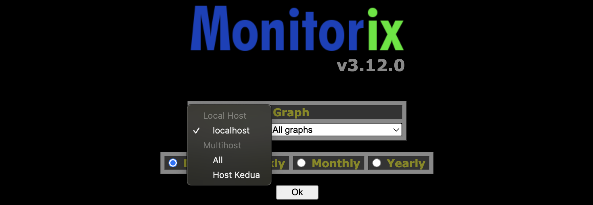
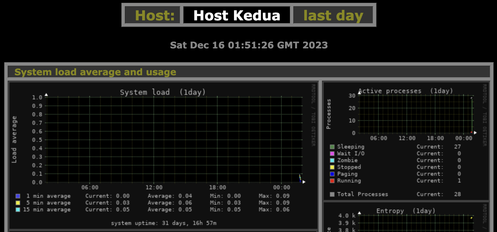

Memonitor _multi-host_ pada suatu jaringan atau infrastruktur dapat menjadi tantangan tersendiri, terutama ketika Anda mengelola beberapa server. [Monitorix](https://www.monitorix.org) hadir sebagai solusi untuk memantau dan menganalisis kondisi serta kinerja _multi-host_ secara efisien. Artikel ini akan membantu Anda melakukan instalasi dan konfigurasi Monitorix untuk memantau beberapa host di sistem operasi Linux Debian/Ubuntu.

## Langkah 1: Persiapan

Sebelum memulai instalasi Monitorix, pastikan bahwa Anda telah menyiapkan lingkungan dengan koneksi jaringan yang memadai antara host yang akan dimonitor dan host tempat Anda akan menginstal Monitorix.

## Langkah 2: Instalasi Monitorix

1. Buka terminal dan pastikan sistem terupdate dengan menjalankan perintah:

   ```bash
   sudo apt update && sudo apt upgrade -y
   ```

2. Install Monitorix menggunakan paket manajemen Debian/Ubuntu:

   ```bash
   sudo apt install monitorix
   ```

3. Lakukan langkah di atas untuk host **pertama** dan **kedua**.

## Langkah 3: Konfigurasi Monitorix

1. Edit file konfigurasi Monitorix di host **pertama**:

   ```bash
   sudo nano /etc/monitorix/monitorix.conf
   ```

2. Di bagian `<multihost>` sesuaikan seperti contoh di bawah ini:

   ```ini
   <multihost>
        enabled = y
        footer_url = y
        graphs_per_row = 2
        default_option_when_all = "System load"
        remotehost_list = Host Kedua
        <remotehost_desc>
                0 = http://ip-host-kedua:8080,/monitorix
        </remotehost_desc>
        groups = n
        remotegroup_list = My Group
        <remotegroup_desc>
                0 = server 2, server 3
        </remotegroup_desc>
   </multihost>
   ```

   Simpan perubahan dan keluar dari editor.

3. Restart servis Monitorix:

   ```bash
   sudo systemctl restart monitorix
   ```

## Langkah 4: Akses Dashboard Monitorix

1. Buka web browser dan akses dashboard Monitorix pada host **pertama**:

   ```bash
   http://ip-host-pertama:8080/monitorix
   ```

2. Pilih **Host Kedua** dari _dropdown_ **Hostname**, lalu tekan **Ok**.
   

3. Anda akan melihat grafik dan informasi terkini dari host yang telah Anda tambahkan ke konfigurasi.
   
## Kesimpulan

Dengan mengikuti langkah-langkah di atas, Anda dapat memantau beberapa host dengan menggunakan Monitorix. Dengan antarmuka yang intuitif dan kemampuan untuk memvisualisasikan data dari beberapa host, Monitorix merupakan alat yang efektif untuk memastikan kondisi dan kinerja sistem secara keseluruhan. Gunakan alat ini untuk mendapatkan wawasan yang mendalam tentang setiap host yang Anda kelola.