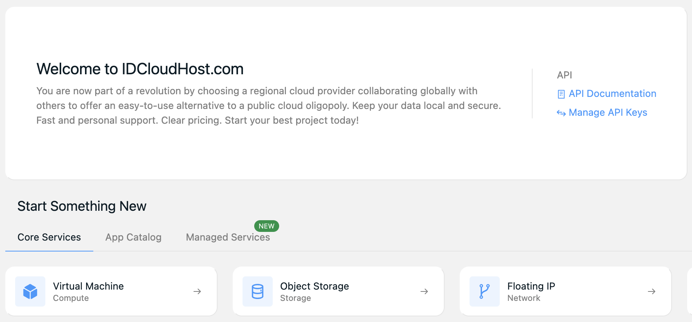
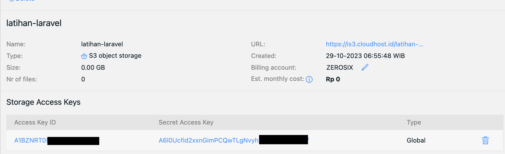

Object Storage IDCloudHost adalah layanan penyimpanan awan yang memungkinkan Anda menyimpan dan mengelola data di cloud IDCloudHost. Dalam artikel ini, kita akan membahas mengapa Anda perlu menggunakan Object Storage IDCloudHost bersama dengan Laravel dan memberikan panduan langkah-demi-langkah untuk menghubungkannya.

## Mengapa Menggunakan Object Storage IDCloudHost dengan Laravel

### 1. Skalabilitas
Object Storage IDCloudHost memungkinkan Anda untuk menyimpan sejumlah besar data tanpa batasan penyimpanan di server lokal. Ini sangat berguna saat aplikasi Anda membutuhkan lebih banyak ruang penyimpanan.

### 2. Kinerja yang Lebih Cepat
Dengan Object Storage IDCloudHost, Anda dapat memanfaatkan infrastruktur server yang canggih, yang dapat meningkatkan kecepatan akses dan pengiriman data. Ini dapat membantu meningkatkan kinerja aplikasi Anda.

### 3. Ketahanan Terhadap Kegagalan
Data yang disimpan di Object Storage IDCloudHost terduplikasi secara otomatis di beberapa lokasi data IDCloudHost yang berbeda. Ini berarti data Anda lebih aman dan dapat diandalkan. Anda tidak perlu khawatir tentang kehilangan data akibat kegagalan perangkat keras atau bencana alam.

### 4. Integrasi Mudah
Laravel memiliki dukungan bawaan untuk menyimpan dan mengambil file dari Object Storage IDCloudHost. Ini membuat integrasi dengan Object Storage IDCloudHost menjadi tugas yang relatif mudah dan efisien.

## Panduan Menghubungkan Object Storage IDCloudHost ke Laravel

### Langkah 1: Membuat Akun

Langkah pertama adalah membuat akun Console IDCloudHost, jika belum memiliki Kunjungi [https://console.idcloudhost.com](https://console.idcloudhost.com/referral/qj3k47) dan ikuti panduan pendaftaran.

### Langkah 2: Membuat Bucket di Object Storage IDCloudHost

Setelah memiliki akun IDCloudHost, Anda perlu membuat "bucket" di Object Storage IDCloudHost

1. Login ke panel Cloud VPS di halaman https://console.idcloudhost.com/hub/login.

2. Setelah berhasil login maka akan tampil halaman awal, langsung pilih __Object Storage__ seperti gambar dibawah.


3. Isikan kolom __Storage name__ lalu klik __Create__.


4. Seterah berhasil klik __nama buket__ pada kolom sebelah kiri, maka akan di arahkan ke halaman yang menampilkan __Access Key ID__, __Secret Access Key__, __URL__ dan __Name__ (nama bucket).


### Langkah 3: Konfigurasi Laravel

Instal Flysystem S3 package menggunakan Composer.

```bash
composer require league/flysystem-aws-s3-v3 "^3.0" --with-all-dependencies
```

Konfigurasikan Laravel untuk menggunakan kredensial IDCloudHost yang telah dibuat pada langkah sebelumnya ke berkas `.env`.

```makefile
AWS_ACCESS_KEY_ID=<Access Key ID>
AWS_SECRET_ACCESS_KEY=<Secret Access Key>
AWS_DEFAULT_REGION=us-east-1
AWS_BUCKET=<Nama Bucket>
AWS_USE_PATH_STYLE_ENDPOINT=true
AWS_ENDPOINT=https://is3.cloudhost.id
```

### Langkah 4: Menggunakan Object Storage IDCloudHost dalam Laravel

Sekarang Anda dapat menggunakan Object Storage IDCloudHost dalam aplikasi Laravel Anda. Anda dapat mengunggah, mengambil, atau menghapus file dengan mudah menggunakan driver Object Storage IDCloudHost yang telah Anda konfigurasikan.

```php
use Illuminate\Support\Facades\Storage;

Storage::disk('s3')->put('file.jpg', $fileContents);
```

## Kesimpulan

Menghubungkan Object Storage IDCloudHost ke Laravel dapat memberikan berbagai manfaat, seperti skalabilitas, kinerja yang lebih cepat, ketahanan terhadap kegagalan, dan integrasi mudah. Dengan panduan di atas, Anda sekarang memiliki pengetahuan yang dibutuhkan untuk mulai menggunakan Object Storage IDCloudHost dalam aplikasi Laravel Anda. Manfaatkan keunggulan penyimpanan Object Storage IDCloudHost untuk membantu mengoptimalkan aplikasi Anda dan memastikan keamanan dan skalabilitas data yang lebih baik.

## Referensi

1. [Membuat Bucket di Object Storage IDCloudHost](https://idcloudhost.com/panduan/membuat-bucket-di-object-storage-idcloudhost/)

2. [Laravel File Storage](https://laravel.com/docs/10.x/filesystem)